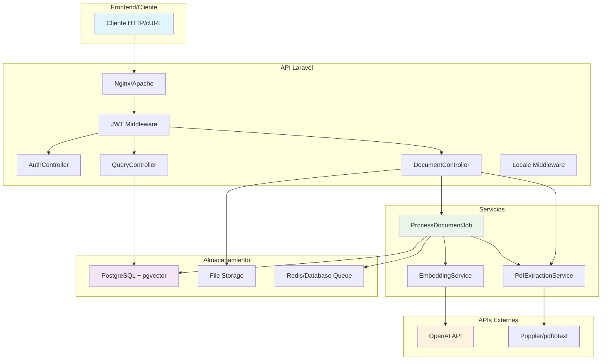
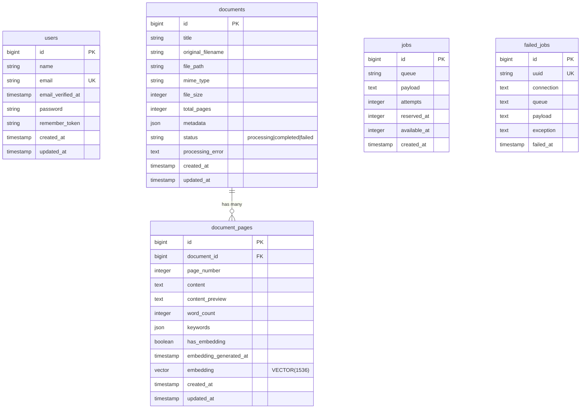
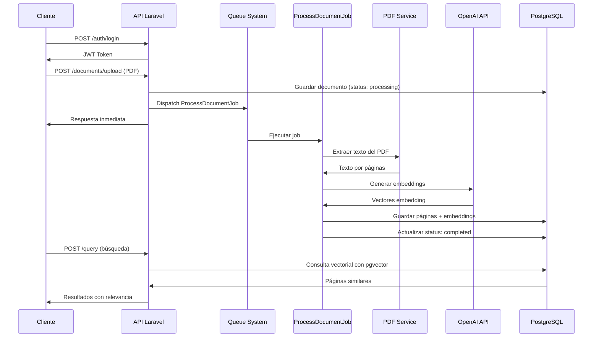

# 🔍 Sistema de Embeddings y Búsqueda Semántica en Laravel

> Un sistema avanzado de búsqueda semántica que permite subir documentos PDF, extraer su contenido, generar embeddings con OpenAI y realizar consultas inteligentes usando pgvector en PostgreSQL.

## 📋 Tabla de Contenidos

- [🚀 Características Principales](#-características-principales)
- [🏗️ Arquitectura del Sistema](#️-arquitectura-del-sistema)
- [🛠️ Tecnologías Utilizadas](#️-tecnologías-utilizadas)
- [⚡ Instalación Rápida](#-instalación-rápida)
- [🐳 Configuración con Docker](#-configuración-con-docker)
- [🔧 Configuración del Proyecto](#-configuración-del-proyecto)
- [📊 Estructura de la Base de Datos](#-estructura-de-la-base-de-datos)
- [🌐 Endpoints de la API](#-endpoints-de-la-api)
- [🧪 Testing y Pruebas](#-testing-y-pruebas)
- [🔍 Ejemplos de Uso](#-ejemplos-de-uso)
- [🐛 Troubleshooting](#-troubleshooting)

## 🚀 Características Principales

### ✅ Funcionalidades Implementadas

- **🔐 Autenticación JWT**: Sistema completo de registro, login y gestión de tokens
- **📄 Procesamiento de PDFs**: Extracción de texto por página con limpieza de caracteres
- **🤖 Embeddings con OpenAI**: Generación de vectores semánticos usando text-embedding-3-small
- **🔍 Búsqueda Híbrida**: Combinación de búsqueda vectorial y texto completo
- **⚡ Procesamiento Asíncrono**: Jobs en background para documentos grandes
- **🌍 Internacionalización**: Soporte multiidioma con Accept-Language
- **📊 Base Vectorial**: PostgreSQL con pgvector para búsquedas de similitud
- **🔧 API REST Completa**: Endpoints documentados y testados

### 🎯 Casos de Uso Reales

- **Base de conocimientos empresariales** 📚
- **Sistemas de documentación técnica** 📖
- **Asistentes virtuales inteligentes** 🤖
- **Análisis de documentos legales** ⚖️
- **Búsqueda en bibliotecas digitales** 🏛️

## 🏗️ Arquitectura del Sistema



## 🛠️ Tecnologías Utilizadas

### Backend Core
- **Laravel 5.14.0** - Framework PHP moderno y elegante
- **PHP 8.4** - Última versión con performance mejorado
- **PostgreSQL 17** - Base de datos robusta y confiable

### Extensiones Especializadas
- **pgvector** - Búsqueda de similitud vectorial en PostgreSQL
- **Poppler Utils** - Extracción de texto de documentos PDF
- **OpenAI API** - Generación de embeddings semánticos

### Librerías y Paquetes
- **tymon/jwt-auth** - Autenticación JWT para APIs
- **spatie/pdf-to-text** - Procesamiento de archivos PDF
- **openai-php/laravel** - Cliente oficial de OpenAI para PHP
- **pgvector/pgvector-php** - Soporte nativo de pgvector

### DevOps y Herramientas
- **Docker Compose** - Orquestación de servicios
- **Redis** - Cache y sistema de colas (opcional)
- **Nginx** - Servidor web de alta performance

## ⚡ Instalación Rápida

### Prerrequisitos

```bash
# Verificar versiones mínimas
php --version    # PHP 8.4+
docker --version # Docker 20.10+
composer --version # Composer 2.0+

# En macOS, instalar Homebrew si no lo tienes
/bin/bash -c "$(curl -fsSL https://raw.githubusercontent.com/Homebrew/install/HEAD/install.sh)"

# Instalar poppler para extracción de PDFs
brew install poppler
```

### Setup en 5 Minutos

```bash
# 1. Clonar y setup del proyecto
git clone <tu-repo>
cd laravel-semantic-search
composer install

# 2. Configuración básica
cp .env.example .env
php artisan key:generate
php artisan jwt:secret

# 3. Levantar servicios
docker-compose up -d postgres_service

# 4. Configurar base de datos
php artisan migrate

# 5. Iniciar servidor
php artisan serve
```

¡Y listo! Tu API estará funcionando en `http://127.0.0.1:8000` 🎉

## 🐳 Configuración con Docker

### Docker Compose Setup

Nuestro `docker-compose.yml` incluye PostgreSQL con pgvector preconfigurado:

```yaml
version: '3.8'

services:
  postgres_service:
    image: pgvector/pgvector:pg17
    container_name: postgres_agent_ia
    restart: always
    environment:
      POSTGRES_DB: agentia
      POSTGRES_USER: agentia  
      POSTGRES_PASSWORD: ******
    volumes:
      - ./config/schema_vector.sql:/docker-entrypoint-initdb.d/schema.sql
    ports:
      - "5439:5432"
```

### Verificación de pgvector

```bash
# Conectar a PostgreSQL
docker exec -it postgres_agent_ia psql -U agentia -d agentia

# Verificar extensión
\dx  # Debería mostrar 'vector'

# Probar funcionalidad vectorial
CREATE TABLE test_vectors (id SERIAL PRIMARY KEY, embedding VECTOR(3));
INSERT INTO test_vectors (embedding) VALUES ('[1,2,3]');
SELECT * FROM test_vectors;
```

### Comandos Docker Útiles

```bash
# Ver logs del contenedor
docker logs postgres_agent_ia

# Backup de la base de datos
docker exec postgres_agent_ia pg_dump -U agentia agentia > backup.sql

# Restaurar backup
docker exec -i postgres_agent_ia psql -U agentia agentia < backup.sql

# Limpiar y reiniciar
docker-compose down
docker-compose up -d --force-recreate
```

## 🔧 Configuración del Proyecto

### Variables de Entorno (.env)

```env
# Configuración básica de Laravel
APP_NAME="Semantic Search API"
APP_ENV=local
APP_KEY=base64:tu-clave-generada
APP_DEBUG=true
APP_URL=http://localhost:8000

# Base de datos PostgreSQL
DB_CONNECTION=pgsql
DB_HOST=127.0.0.1
DB_PORT=5439
DB_DATABASE=agentia
DB_USERNAME=agentia
DB_PASSWORD=******

# Sistema de colas
QUEUE_CONNECTION=database  # o 'sync' para testing

# OpenAI API (obligatorio para embeddings)
OPENAI_API_KEY=sk-tu-clave-real-aqui
OPENAI_ORGANIZATION=

# JWT Authentication
JWT_SECRET=tu-jwt-secret-generado
JWT_TTL=60
JWT_REFRESH_TTL=20160

# Logging y debugging
LOG_CHANNEL=stack
LOG_LEVEL=debug
```

### Configuración de JWT

```bash
# Publicar configuración JWT
php artisan vendor:publish --provider="PHPOpenSourceSaver\JWTAuth\Providers\LaravelServiceProvider"

# Generar clave secreta
php artisan jwt:secret

# El archivo config/jwt.php se crea automáticamente
```

### Configuración de Colas

```bash
# Crear tablas para el sistema de colas
php artisan queue:table
php artisan queue:failed-table
php artisan migrate

# Ejecutar worker (en producción usar supervisor)
php artisan queue:work --verbose
```

## 📊 Estructura de la Base de Datos

### Diagrama de Relaciones



### Índices Optimizados

```sql
-- Índice HNSW para búsqueda vectorial eficiente
CREATE INDEX document_pages_embedding_idx 
ON document_pages USING hnsw (embedding vector_cosine_ops);

-- Índices tradicionales para performance
CREATE INDEX idx_documents_status ON documents(status);
CREATE INDEX idx_pages_has_embedding ON document_pages(has_embedding);
CREATE INDEX idx_pages_document_page ON document_pages(document_id, page_number);
```

### Migraciones Principales

```bash
# Ver estado de migraciones
php artisan migrate:status

# Ejecutar migraciones pendientes
php artisan migrate

# Rollback si es necesario (¡cuidado en producción!)
php artisan migrate:rollback

# Refrescar todo (solo en desarrollo)
php artisan migrate:fresh --seed
```

## 🌐 Endpoints de la API

### 🔐 Autenticación

| Método | Endpoint | Descripción | Auth |
|--------|----------|-------------|------|
| POST | `/api/auth/register` | Registro de usuario | No |
| POST | `/api/auth/login` | Iniciar sesión | No |
| GET | `/api/auth/profile` | Perfil de usuario | Sí |
| POST | `/api/auth/logout` | Cerrar sesión | Sí |
| POST | `/api/auth/refresh` | Renovar token | Sí |

### 📄 Gestión de Documentos

| Método | Endpoint | Descripción | Auth |
|--------|----------|-------------|------|
| GET | `/api/documents` | Listar documentos | Sí |
| POST | `/api/documents/upload` | Subir PDF | Sí |
| GET | `/api/documents/{id}` | Ver documento | Sí |
| GET | `/api/documents/{id}/pages/{page}` | Ver página específica | Sí |
| DELETE | `/api/documents/{id}` | Eliminar documento | Sí |

### 🔍 Búsqueda Semántica

| Método | Endpoint | Descripción | Auth |
|--------|----------|-------------|------|
| POST | `/api/query` | Búsqueda semántica | Sí |
| GET | `/api/query/stats` | Estadísticas del sistema | Sí |

### 🏥 Health Check

| Método | Endpoint | Descripción | Auth |
|--------|----------|-------------|------|
| GET | `/api/health` | Estado del sistema | No |

## 🧪 Testing y Pruebas

### Suite de Pruebas con cURL

#### 1. Health Check
```bash
curl -X GET http://127.0.0.1:8000/api/health
# Respuesta esperada: {"success":true,"message":"API funcionando correctamente"}
```

#### 2. Registro de Usuario
```bash
curl -X POST http://127.0.0.1:8000/api/auth/register \
  -H "Content-Type: application/json" \
  -H "Accept: application/json" \
  -d '{
    "name": "Usuario Prueba",
    "email": "test@example.com", 
    "password": "password123",
    "password_confirmation": "password123"
  }'
```

#### 3. Login y Obtener Token
```bash
curl -X POST http://127.0.0.1:8000/api/auth/login \
  -H "Content-Type: application/json" \
  -H "Accept: application/json" \
  -d '{
    "email": "test@example.com",
    "password": "password123"
  }'

# ⚠️ IMPORTANTE: Guarda el token de la respuesta
export TOKEN="eyJ0eXAiOiJKV1QiLCJhbGciOiJIUzI1NiJ9..."
```

#### 4. Subir Documento PDF
```bash
curl -X POST http://127.0.0.1:8000/api/documents/upload \
  -H "Accept: application/json" \
  -H "Authorization: Bearer $TOKEN" \
  -F "file=@/ruta/a/tu/documento.pdf" \
  -F "title=Mi Documento de Prueba"
```

#### 5. Verificar Procesamiento
```bash
# Ver estado del documento (debería cambiar de "processing" a "completed")
curl -X GET http://127.0.0.1:8000/api/documents/1 \
  -H "Authorization: Bearer $TOKEN"

# Ejecutar worker si es necesario
php artisan queue:work --once
```

#### 6. Realizar Búsqueda
```bash
# Búsqueda por texto completo
curl -X POST http://127.0.0.1:8000/api/query \
  -H "Content-Type: application/json" \
  -H "Authorization: Bearer $TOKEN" \
  -d '{
    "query": "palabra clave del documento",
    "search_type": "fulltext",
    "limit": 5
  }'

# Búsqueda semántica (requiere OpenAI API key)
curl -X POST http://127.0.0.1:8000/api/query \
  -H "Content-Type: application/json" \
  -H "Authorization: Bearer $TOKEN" \
  -d '{
    "query": "concepto relacionado",
    "search_type": "semantic", 
    "limit": 5,
    "similarity_threshold": 0.7
  }'
```

### Tests Automatizados

```bash
# Ejecutar tests unitarios
php artisan test

# Test específico de features
php artisan test --filter=DocumentUploadTest

# Test con cobertura
php artisan test --coverage

# Test de la API completa
php artisan test tests/Feature/ApiTest.php
```

### Debugging y Logs

```bash
# Ver logs en tiempo real
tail -f storage/logs/laravel.log

# Logs de queries SQL (útil para debugging)
# En .env: DB_LOG_QUERIES=true

# Limpiar logs
echo "" > storage/logs/laravel.log

# Ver estadísticas del sistema
curl -X GET http://127.0.0.1:8000/api/query/stats \
  -H "Authorization: Bearer $TOKEN"
```

## 🔍 Ejemplos de Uso

### Flujo Completo de Trabajo



### Casos de Uso Avanzados

#### Búsqueda Híbrida Inteligente
```bash
# Combina búsqueda vectorial + texto completo
curl -X POST http://127.0.0.1:8000/api/query \
  -H "Content-Type: application/json" \
  -H "Authorization: Bearer $TOKEN" \
  -d '{
    "query": "contratos de arrendamiento urbano",
    "search_type": "hybrid",
    "limit": 10,
    "similarity_threshold": 0.75
  }'
```

#### Análisis de Documentos Grandes
```bash
# El sistema maneja automáticamente PDFs grandes
# - Extracción por páginas
# - Procesamiento asíncrono 
# - Embeddings optimizados por chunks
```

#### Búsqueda Multiidioma
```bash
# Funciona automáticamente con Accept-Language
curl -X POST http://127.0.0.1:8000/api/query \
  -H "Content-Type: application/json" \
  -H "Accept-Language: es,en;q=0.9" \
  -H "Authorization: Bearer $TOKEN" \
  -d '{"query": "búsqueda en español"}'
```

## 🐛 Troubleshooting

### Problemas Comunes y Soluciones

#### 🔧 Error: "binary was not found"
```bash
# macOS
brew install poppler

# Ubuntu/Debian  
sudo apt-get install poppler-utils

# Verificar instalación
which pdftotext
pdftotext -v
```

#### 🔧 Error: PostgreSQL Connection Failed
```bash
# Verificar que Docker esté ejecutándose
docker ps | grep postgres

# Reiniciar contenedor
docker-compose restart postgres_service

# Ver logs del contenedor
docker logs postgres_agent_ia
```

#### 🔧 Error: "You exceeded your current quota" (OpenAI)
```bash
# Verificar créditos en https://platform.openai.com/usage
# Alternativa temporal: cambiar a modo sync
# En .env: QUEUE_CONNECTION=sync
```

#### 🔧 Error: Job no se ejecuta
```bash
# Verificar que las tablas de queue existen
php artisan queue:table
php artisan migrate

# Ejecutar worker manualmente
php artisan queue:work --once --verbose

# Ver jobs fallidos
php artisan queue:failed
```

#### 🔧 Error: Invalid UTF-8 sequence
```bash
# El sistema limpia automáticamente caracteres problemáticos
# Si persiste, verificar que PostgreSQL use codificación UTF-8
docker exec -it postgres_agent_ia psql -U agentia -c "SHOW server_encoding;"
```

### Logs y Debugging

```bash
# Logging detallado
tail -f storage/logs/laravel.log | grep "ProcessDocumentJob\|ERROR\|EXCEPTION"

# Debugging SQL queries
# En .env: DB_LOG_QUERIES=true

# Debug específico de embeddings
php artisan tinker
>>> app(App\Services\EmbeddingService::class)->generateEmbedding('test');
```

### Performance y Optimización

```bash
# Optimizar configuración de PHP
# En php.ini:
# memory_limit = 512M
# max_execution_time = 300
# upload_max_filesize = 50M

# Cache de configuración en producción
php artisan config:cache
php artisan route:cache
php artisan view:cache

# Optimización de PostgreSQL para vectores
# En postgresql.conf:
# shared_preload_libraries = 'vector'
# max_connections = 200
```

---

## 👨‍💻 Notas del Desarrollo


### 🔧 Problemas Encontrados y Soluciones

#### 1. Codificación UTF-8 en PDFs
**Problema**: Caracteres especiales (`<E2><C3>`) causaban errores SQL
**Solución**: Limpieza sistemática con regex y normalización UTF-8

#### 2. Jobs Colgando en Background
**Problema**: ProcessDocumentJob se ejecutaba pero no completaba
**Solución**: Refactor usando ID en lugar de modelo completo + mejor error handling

#### 3. Performance en Búsqueda Vectorial
**Problema**: Consultas lentas con muchos vectores
**Solución**: Índices HNSW + optimización de queries + threshold inteligente

### 🧪 Metodología de Testing

1. **TDD Approach**: Tests antes de implementación
2. **Integration Testing**: Pruebas end-to-end con Docker
3. **Performance Testing**: Benchmarks de búsqueda vectorial
4. **Error Boundary Testing**: Casos edge con PDFs corruptos

---
### ✅ Checklist Final:

- [x] **Infraestructura**
  - [x] Docker con PostgreSQL + pgvector funcionando
  - [x] Extensión vector instalada en PostgreSQL
  - [x] Índice HNSW creado para búsquedas vectoriales

- [x] **Autenticación JWT**
  - [x] Registro funciona y devuelve token
  - [x] Login funciona y devuelve token
  - [x] Rutas protegidas requieren token válido
  - [x] Refresh token funciona

- [x] **Carga de PDFs**
  - [x] Upload acepta solo PDFs
  - [x] Validación de tamaño máximo (10MB)
  - [x] Archivo se guarda correctamente
  - [x] Job se ejecuta en background

- [x] **Procesamiento de Documentos**
  - [x] Texto se extrae correctamente
  - [x] Se crean registros de páginas
  - [x] Embeddings se generan para cada página
  - [x] Estado del documento se actualiza

- [x] **Búsqueda Semántica**
  - [x] Query genera embedding correctamente
  - [x] Búsqueda por similitud coseno funciona
  - [x] Resultados ordenados por relevancia
  - [x] Búsqueda híbrida combina resultados

- [x] **Internacionalización**
  - [x] Header Accept-Language se detecta
  - [x] Locale se establece correctamente
  - [x] Response incluye Content-Language

### Gracias